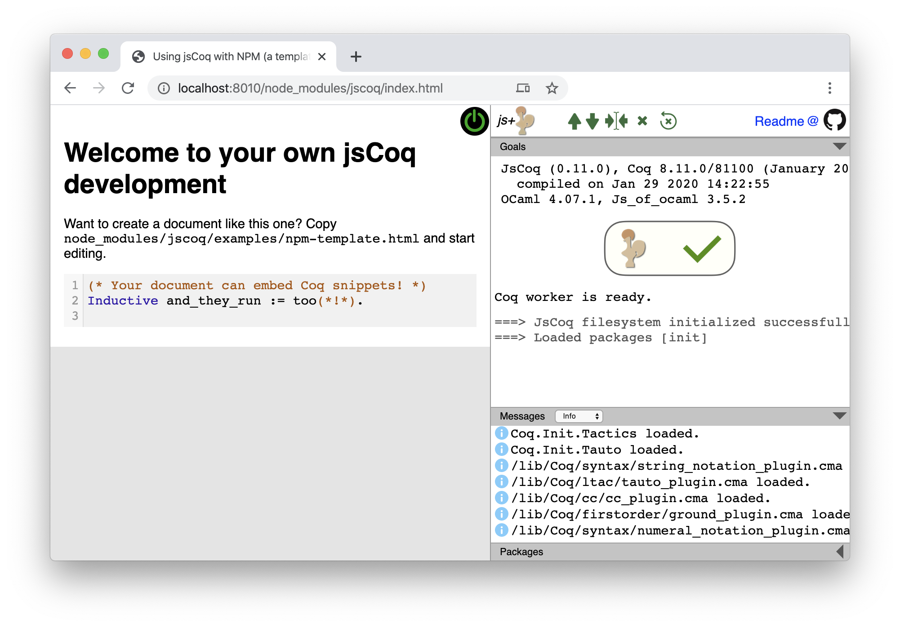

# Embedding jsCoq

This quick tutorial will allow you to embed jsCoq in your web page.
It is especially useful when you have generated your page using
`coqdoc`.

## Preparation

The easiest way to obtain a distribution of jsCoq for the purpose of serving as part of your site is via `npm`.
If you already have a `package.json` file in your project, great.
Otherwise, in the root directory of your project, run `npm init`.
You will be asked to type the name of the project and a few other details, and then a `package.json` will be created.
Of course, creating a `package.json` file with any text editor is also acceptable.

Now run:
```
% npm i jscoq
```

And you have installed jsCoq in your project!
You will find it under `node_modules/jscoq`.
To test your new setup, serve your project root directory over HTTP(S), and navigate to `node_modules/jscoq/index.html`.



## Combining with your Coq development

If you're starting fresh, copying `node_modules/examples/npm-template.html` into the root directory of your project and writing your content there would be easiest.

Notice that if you want to put your HTML file(s) in a subfolder, you will have to adjust the paths (`<script src="...">`, `base_path: '...'`, and `'./node_modules'`) to the appropriate relative or absolute URL paths.

Sometimes, though, you will already have an HTML document, and want to "inject" jsCoq into it.
This is typical when using `coqdoc`:
your development is contained in a `.v` file, which `coqdoc` transforms into HTML.

The following boilerplate code can help you get started:
[jscoq-agent.js](../frontend/classic/js/jscoq-agent.js).
Either include it directly with a `<script>` tag or copy it to your
project and then include it from there, which will allow you to customize it.
Notice that it is an ES module, so that it has to be included with `type="module"`.

```html
<script src="node_modules/jscoq/frontend/classic/js/jscoq-agent.js" type="module"></script>
```

If you want to add those lines automatically as part as your build process, you can use the bundled utility script `jscoqdoc`:
```
npx jscoqdoc my_cool_proofs.v
```

## Instrumenting CoqDoc to generate HTML

An alternative to instrument CoqDoc vanilla HTML code is to use `udoc`.

`udoc` is a `coqdoc` replacement that is better suited to produce
jsCoq output while (mostly) remaining compatible is being developed at
https://github.com/ejgallego/udoc

It works OK for converting `coqdoc` files, but it may produce some
artifacts and have bugs; feel free to submit improvements.

## Main entry point from HTML and API

jsCoq's main entry point is the `CoqManager` JavaScript object used for
launching a Coq worker and embedding Coq functionality in
your particular application, blog, or webpage. The basic pattern to
add jsCoq to webpage with Coq code is:

```html
  <script type="module">
    import { JsCoq } from './node_modules/jscoq/jscoq.js';  /* path to installed package */
    JsCoq.start($path, $list_of_ids, {$options});
  </script>
```

where `$path` is the path the jsCoq distribution, and `$list_of_ids` is
a list of `<textarea>`s or `<div>`s that will form the Coq document.
CSS selectors are also allowed as part of `$list_of_ids`: all matching elements
will be added to the document.
All parameters are optional.
If `$path` is omitted, `jscoq-loader.js` will infer the path from the `<script>` tag whence it was referenced.
If `$list_of_ids` is omitted, `'ide-wrapper'` is used. If the correponding element is empty, `CoqManager` will create a single empty editor in it.
See below for available `$options` and their defaults.

The jsCoq [landing webpage](index.html) is a good running example.

### Options

jsCoq accepts the following options as an optional second parameter to
the `CoqManager` constructor:

| Key             | Type            | Default         | Description                                                                                                   |
|-----------------|-----------------|-----------------|---------------------------------------------------------------------------------------------------------------|
| `base_path`     | string          | auto            | Path where jsCoq is installed.                                                                                |
| `wrapper_id`    | string          | `'ide-wrapper'` | Id of `<div>` element in which the jsCoq panel is to be created.                                              |
| `layout`        | string          | `'flex'`        | Choose between a flex-based layout (`'flex'`) and one based on fixed positioning (`'fixed'`).                 |
| `all_pkgs`      | array of string / object        | (see below)     | List of available packages that will be listed in the packages panel.                                         |
| `init_pkgs`     | array of string | `['init']`      | Packages to load at startup.                                                                                  |
| `init_import`   | array of string | `[]`            | Modules to `Require Import` on startup.                                                                       |
| `prelude`       | boolean         | `true`          | Load the Coq prelude (`Coq.Init.Prelude`) at startup. (If set, make sure that `init_pkgs` includes `'init'`.) |
| `implicit_libs` | boolean         | `false`         | Allow `Require`ing Coq built-in modules by short name only (e.g., `Require Arith.`).                          |
| `theme`         | string          | `'light'`       | IDE theme to use; includes icon set and color scheme. Supported values are `'light'` and `'dark'`.            |
| `show`          | boolean         | `true`          | Opens up the jsCoq panel on startup.                                                                          |
| `focus`         | boolean         | `true`          | Sets the focus to the editor once jsCoq is ready.                                                             |
| `replace`       | boolean         | `false`         | Replace `<div>`(s) referred to by `jscoq_ids` with jsCoq editors, moving the text content.                    |
| `line_numbers`  | string          | `continue`      | Line numbering policy; across code snippets on page (`continue`) or separate per snippet (`restart`).         |
| `file_dialog`   | boolean         | `false`         | Enables UI for loading and saving files (^O/^S, or ⌘O/⌘S on Mac).                                             |
| `editor`        | object          | `{}`            | Additional options to be passed to CodeMirror.                                                                |
| `coq`           | object          | `{}`            | Additional Coq option values to be set at startup.                                                            |

The list of available packages defaults to all Coq libraries and addons
available with the current version of jsCoq. At the moment, it is:
```js
['coq', 'mathcomp', 'elpi', 'equations', 'extlib', 'simpleio', 'quickchick', 
 'software-foundations', 'hahn', 'paco', 'snu-sflib', 'promising']
```

By default, packages are loaded from jsCoq's `coq-pkgs` directory.
Affiliated addon packages (those in the list above) are sought in the `@jscoq`
[scope](https://docs.npmjs.com/about-scopes), *i.e.* `node_modules/@jscoq/<addon name>`.
You can normally install these addons with `npm i @jscoq/<addon name>`.

Package download URLs can be controlled by passing an object instead of an array; the keys of
the object correspond to base directories where package files (`.coq-pkg`) are located.
```js
{'../coq-pkgs': ['coq'], '/my-pkgs': ['cool-stuff']}
```

The `editor` property may contain any option supported by CodeMirror
(see [here](https://codemirror.net/doc/manual.html#config)).

The `coq` property may hold a list of Coq properties mapped to their
values, and is case sensitive (see [here](https://coq.inria.fr/refman/coq-optindex.html)).
For example:
```js
{'Implicit Arguments': true, 'Default Timeout': 10}
```

