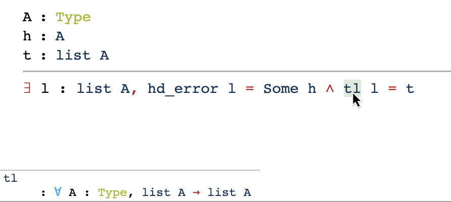

## Basic Usage

The main page showcases a simple proof about lists (involutority of `rev`). Other examples are listed under the ‘Examples’ menu at the top navbar.

Once jsCoq finishes loading, you can step through the proof using the
arrow buttons on the toolbar (top right), or using these keyboard
shortcuts:

| Shortcut           | Action           |
|--------------------|------------------|
| Alt-N or Alt-↓     | Go to next       |
| Alt-P or Alt-↑     | Go to previous   |
| Alt-Enter or Alt-→ | Go to cursor     |

You can open a blank editor and experiment with your own Coq developments using the
[scratchpad](https://jscoq.github.io/node_modules/jscoq/examples/scratchpad.html).
The same keyboard shortcuts apply here.

The scratchpad's contents are saved in your browser's local storage (IndexedDB, specifically),
so they are not lost if you close the browser window or refresh the page.
You can, in fact, store more than one document using the local open/save file dialogs:

| Shortcut           | Action                                                                       |
|--------------------|------------------------------------------------------------------------------|
| Ctrl-S             | Save file (with the last name provided, or `untitled.v`)                     |
| Ctrl-Shift-S       | Save file as (prompts for file name; also has options to download or share the content)  |
| Ctrl-Alt-S         | Save file to disk (using the browser's Save dialog, or preset destination)   |
| Ctrl-O             | Open file (prompts for file name, supports tab completion)                   |
| Ctrl-Alt-O         | Open file from disk (using the browser's Open dialog)                        |

On Mac, replace Ctrl with ⌘ (command) and Alt with ⌥ (option), as is traditional.

Drag `.v` files from your local drive onto the scratchpad to open them.
You can also drag multiple files, which will open up a project pane to the left of the editor, allowing you to switch between them; this functionality is still experimental.

### Sharing your development

A small pastebin-like server based on [Hastebin](https://hastebin.com) is available for sharing `.v` files between users.
In the scratchpad, open the save dialog (Ctrl-Shift-S) and click "Share". After a short delay, the URL in your browser's location bar will change to something like `.../scratchpad.html?share=hb-inuguyipuh`. Copy this URL and share it with anyone you like.
The URL represents the state of the document at the moment it was shared, and this state is read-only. Every time you click "Share", a fresh URL is generated.

*Notice.* Shared content is not saved forever; documents are typically available for a period of ~30 days.


## Navigating and Inspecting Proofs

Besides navigation with keyboard shortcuts and toolbar buttons, jsCoq offers
a mechanism for peeking into intermediate states of the proof.
Executed statement that generate proof goals (`Theorem`, `Lemma`, `Goal`, and
all tactics and bullets in proof mode) will be highlighted when the mouse cursor
hovers on them.
Press and hold Ctrl to temporarily switch the goal view to show this intermediate state.
If the document is in proof mode at the time you pressed Ctrl, the display will revert to the current goal once Ctrl is released, to avoid confusion.
Otherwise, the peeked goal remains on the panel until another state is peeked or until a new proof commences.


The identifiers and notations in the goal pane are responsive.
Hover an identifier to reveal its type in the bottom-left corner of the goal pane.
The hint disappears when the cursor leaves the identifier. If you want it to stick around, click the identifier. Click anywhere to release the stick.
Whenever an identifier's type is shown in the corner of the pane,
you can click Alt (⌥ on Mac) to inspect its definition — which is akin to running the `Print` vernacular command.
The definition will be shown in the same place, replacing the type.

Placing the editor cursor over a recognized identifier will also trigger
showing its type in the hint area of the goal pane.
jsCoq knows about all lemmas and constants from the Coq standard library, as well as definitions in the current file that have already executed.
If the hint shows an identifier as `(not available)`, it means that the module containing the symbol has not been `Require`d.

## company-coq Addon

Inspired by [company-coq](https://github.com/cpitclaudel/company-coq), jsCoq provides
formatting of identifiers and symbols automatically during edits.
It can be enabled or disabled in the settings panel (the vertical ellipsis on the top left).
It is enabled by default in the scratchpad.
It can also be enabled on your own pages by setting `editor: {mode: {'company-coq': true}}` in the configuration.

 * Special symbols: company-coq mode converts the following tokens to Unicode symbols:
 ```
'/\': '∧', '\/': '∨', '->': '→', '<-': '←', '<->': '↔', 
'=>': '⇒', '>->': '↣', '|-': '⊢',
'<=': '≤', '>=': '≥', '<>': '≠',
'fun': 'λ', 'forall': '∀', 'exists': '∃', 
'Real': 'ℝ', 'nat': 'ℕ', 'Prop': 'ℙ'
```
 * Numerical subscripts: any identifier of the form `name123` is formatted with a trailing subscript index, `name`<sub>`123`</sub>. Identifiers like `name_123` are untouched.
 * Other subscripts: two consecutive underscores can be used to generate arbitrary subscript suffixes. `clemént_is__a_cool_dude` becomes `clemént_is`<sub>`a_cool_dude`</sub>.

Comments and names of tactics are never modified by company-coq.

### Autocompletion

The company-coq addon also provides code completion by offering completions for
names of tactics and lemmas from the standard library, as well as definitions contained in the current file (after they have been executed).
In the drop-down list that opens, hovering the options will show their types in the goals pane to the right, similar to that which is described in "Navigating and Inspecting Proofs" above.

